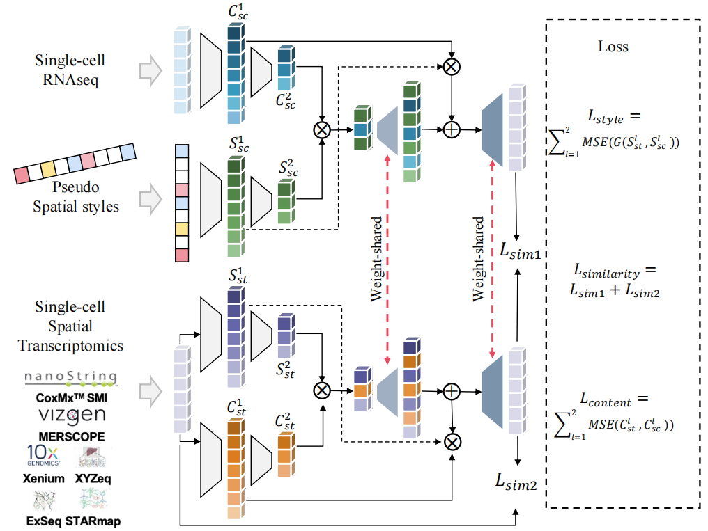

# SpaIM : Single-cell Spatial Transcriptomics Imputation via Style Transfer

Spatial transcriptomics (ST) technologies have transformed our comprehension of cellular ecosystems by offering insights at single-cell spatial resolution. However, these technologies encounter challenges like sparse gene signals and limited gene detection capacities, hindering their ability to fully capture comprehensive spatial gene expression profiles. To tackle these issues, we propose integrating single-cell RNA sequencing (scRNA-seq), which provides rich gene expression data but lacks spatial context, with ST data. Herein, we introduce SpaIM, an innovative method utilizing scRNA-seq information and style transfer learning to predict unmeasured gene expressions, thus improving gene coverage and expressions in ST data. SpaIM separates scRNA-seq and ST data into data-agnostic content and data-specific styles, facilitating gene expression representation in a unified latent space. A specialized style encoder captures ST data's unique characteristics, while a dedicated style generator transforms scRNA data style to match ST data. By leveraging the strengths of scRNA-seq and ST, SpaIM overcomes data sparsity and limited gene coverage challenges, marking a significant advancement in spatial transcriptomics. Moreover, SpaIM outperforms state-of-the-art methods on both sequencing-based and imaging-based spatial transcriptomics data from diverse tissue types. Additionally, SpaIM is released as open-source software, enhancing the depth and utility of spatial gene expression analysis.

# Model Architecture



## Environment

The required environment has been packaged in the [`requirements.txt`](./requirements.txt) file.    
Please run the following command to install.

```commandline
git clone https://github.com/QSong-github/SpaIM
cd SpaIM
pip install -r requirements.txt
```

## Datasets

- You can also download all datasets from [here](https://www.synapse.org/#!Synapse:syn52503858/files/)

## Trained models


