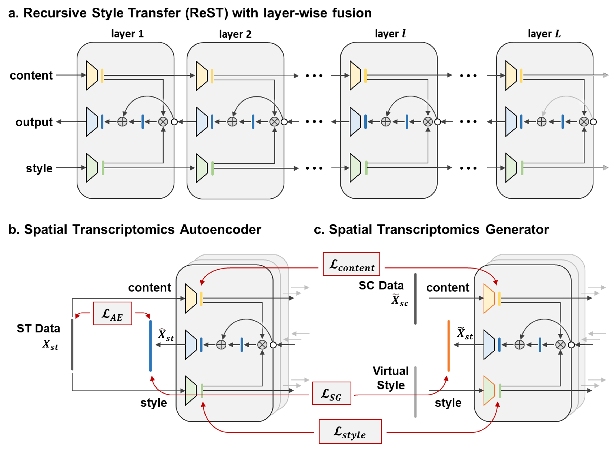

# SpaIM : Single-cell Spatial Transcriptomics Imputation via Style Transfer

To accurately impute unmeasured gene expressions in spatial transcriptomics (ST) data, we introduce SpaIM, a novel style transfer learning model leveraging scRNA-seq (SC) data. SpaIM segregates scRNA-seq and ST data into data-agnostic contents and data-specific styles, with the contents capture the commonalities between the two data types, while the styles highlight their unique differences. By integrating the strengths of scRNA-seq and ST, SpaIM overcomes data sparsity and limited gene coverage issues, making significant advancements over existing methods. This improvement is demonstrated across 53 diverse ST datasets, spanning sequencing- and imaging-based spatial technologies in various tissue types. Additionally, SpaIM enhances downstream analyses, including the detection of ligand-receptor interactions, spatial domain characterization, and identification of differentially expressed genes.


# Getting Started

## Environment

Please run the following command to install.

```commandline
git clone https://github.com/QSong-github/SpaIM
cd SpaIM
conda env create -f environment.yaml
conda activate SpaIM
```

## Datasets

All datasets used in this study are publicly available. 

- Data sources and details are provided in [`Supplemental_Table_1`](./Supplemental_Table_1.xlsx). After the data was downloaded, follow the processing flow in [get_adata_cluster.py](get_adata_cluster.py) to analyse it for clustering.

- Example processed dataset 1 can be downloaded at [synapse](https://www.synapse.org/Synapse:syn64421788).

The datasets structure should be as follows:
```
|-- dataset
    |-- Dataset1
    |-- Dataset2
    |-- ......
    |-- Dataset52
    |-- Dataset53
```

## SpaIM Training and Testing

Train all 53 datasets with one command
```
chmod +x ./*
./run_SpaIM.sh
```

The trained models and metric results are available in the defined folders:
```
./SpaIM_results  # for benchmark datasets
```


