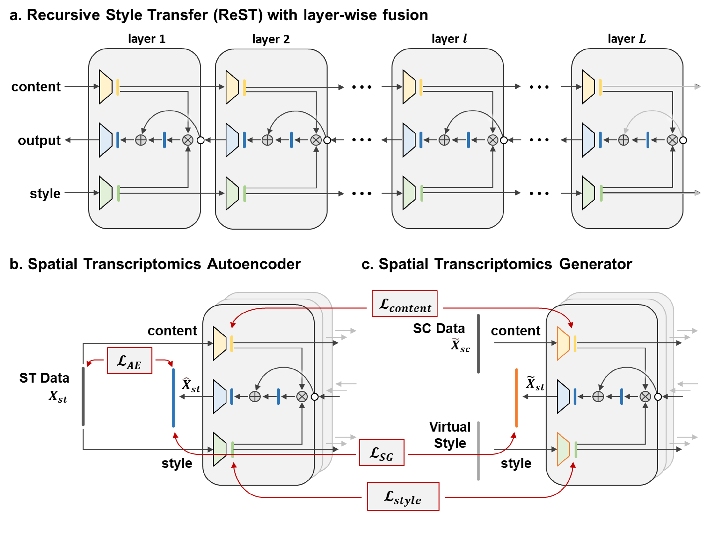

# SpaIM : Single-cell Spatial Transcriptomics Imputation via Style Transfer [[paper]](https://www.biorxiv.org/content/10.1101/2025.01.24.634756v1.full.pdf)

We introduce SpaIM, a novel style transfer learning model that leverages scRNA-seq data to accurately impute unmeasured gene expressions in spatial transcriptomics (ST) data. SpaIM separates scRNA-seq and ST data into data-agnostic contents and data-specific styles, capturing commonalities and unique differences, respectively. By integrating scRNA-seq and ST strengths, SpaIM addresses data sparsity and limited gene coverage, outperforming existing methods across 53 diverse ST datasets. It also enhances downstream analyses like ligand-receptor interaction detection, spatial domain characterization, and differentially expressed gene identification.


# Getting Started

## Environment

Please run the following command to install.

```commandline
git clone https://github.com/QSong-github/SpaIM
cd SpaIM
conda env create -f environment.yaml
conda activate SpaIM
```

## Datasets

All datasets used in this study are publicly available. 

- Data sources and details are provided in [`Supplemental_Table_1`](./Supplemental_Table_1.xlsx). After the data was downloaded, follow the processing flow in [get_adata_cluster.py](get_adata_cluster.py) to analyse it for clustering.

- All processed datasets and example datasets 1 can be downloaded at [synapse](https://www.synapse.org/Synapse:syn64421787/files/) or [zenodo](https://zenodo.org/uploads/14741028).

The datasets structure should be as follows:
```
|-- dataset
    |-- Dataset1
    |-- Dataset2
    |-- ......
    |-- Dataset52
    |-- Dataset53
```

## SpaIM Training and Testing

Train all 53 datasets with one command
```
chmod +x ./*
./run_SpaIM.sh
```

The trained models and metric results are available in the defined folders:
```
./SpaIM_results/Dataset1/  # for benchmark datasets
```

## SpaIM Inference

```
python test_impiutation.py
```
The inference results will exist in './SpaIM_results/Dataset1/impute_sc_result_%d.pkl'.

## Acknowledgments

Our code is based on the [neural-style](https://github.com/jcjohnson/neural-style). Special thanks to the authors and contributors for their invaluable work.

